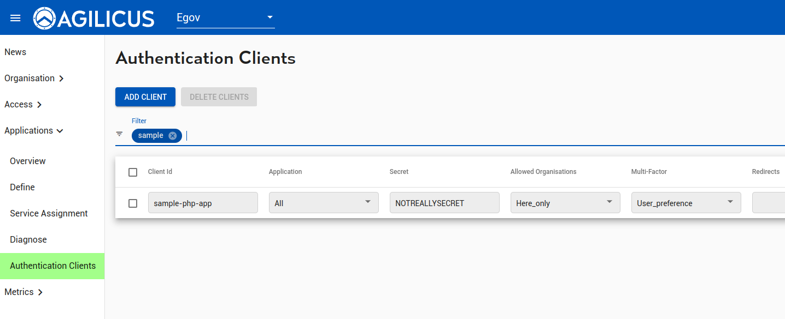

## sample-php-app

[OpenID Connect](https://openid.net/connect/) is a standard for Authenticating
a user and providing identity. It sits on top of OAuth 2.0.

This is a sample for PHP, using the [php-openid-client](https://github.com/facile-it/php-openid-client)
library. Other libraries following the standard will work as well.

Note: Depending on application architecture, you may wish to use different `flows` in OpenID
Connect. The PKCE/Code flow is good for a web-application, the Hybrid Flow may be
more appropriate for a backend session.

A test client has been created.



## Notes

This logs the user in using the code (PKCE) flow. The id_token/access_token
are retrieved by the server-side (using the code).

The access token is set into a cookie (__HOST-access-token) to be enforced
by the Identity-Aware Web Application Firewall. Because the cookie is __HOST-
prefixed (see https://developer.mozilla.org/en-US/docs/Web/HTTP/Headers/Set-Cookie),
it will only be emitted for HTTPS flows.

The userinfo endpoint is interogated which retrieves the user role.

The various OpenID Connect Flows are demonstrated
[here](https://medium.com/@darutk/diagrams-of-all-the-openid-connect-flows-6968e3990660).

## Docker

You may use this demo under docker (or just run the src/index.php file).

```
docker build -t php-example .
docker run --rm -it -p 4200:80 php-example
```

and then open browser to http://localhost:4200

